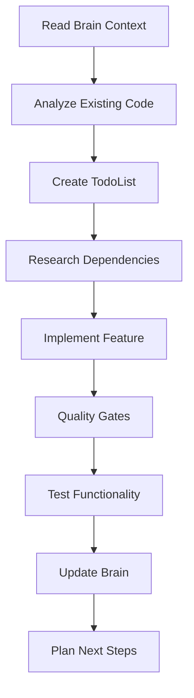

# 🤖 AI Autonomous Development Workflow

**Purpose**: Complete autonomous development process for Mallorca Activities platform  
**Scope**: End-to-end development workflow with quality gates and optimization  
**Framework**: RIPER methodology with brain-driven context

---

## ⚡ **AUTONOMOUS DEVELOPMENT PRINCIPLES**

### **🎯 Core Autonomous Behavior**
1. **ACT IMMEDIATELY** - Execute tasks without waiting for approval
2. **RESEARCH FIRST** - Always check brain context and existing patterns
3. **BATCH OPERATIONS** - Use multiple tool calls simultaneously
4. **QUALITY GATES** - Mandatory type-check, lint, format before commits
5. **DOCUMENT EVERYTHING** - Update brain with learnings and patterns

### **🔄 RIPER Development Cycle**
Execute within each AI response session:

#### **🔍 Research Phase**
- Read relevant brain context files
- Analyze existing codebase patterns
- Understand business requirements
- Check dependencies and integrations

#### **💡 Innovate Phase**  
- Build on established patterns
- Apply business logic requirements
- Consider mobile-first design
- Integrate brand guidelines (pink/yellow theme)

#### **📋 Plan Phase**
- Create detailed TodoList with TodoWrite
- Break down complex features into tasks
- Identify integration points
- Plan testing and validation

#### **⚡ Execute Phase**
- Implement immediately with batch operations
- Follow established coding patterns
- Apply quality standards
- Test functionality

#### **🔎 Review Phase**
- Run mandatory quality checks
- Verify business requirements
- Update brain with new learnings
- Plan next iteration

---

## 🧠 **Brain-Driven Development Process**

### **Session Startup Sequence**
1. **Read Brain Overview** (`brain/README.md`)
2. **Check Platform Context** (`brain/platform-overview.md`)  
3. **Review Development Guidelines** (`brain/development-context.md`)
4. **Select Feature/Page Context** (relevant brain files)
5. **Create Session TodoList** (based on brain task breakdowns)

### **Feature Development Workflow**


### **Brain Context Priority**
1. **Business Requirements** (platform-overview.md)
2. **Technical Patterns** (development-context.md)
3. **Feature Specifications** (features/*.md)
4. **Page Requirements** (pages/*.md)
5. **Implementation Details** (codebase/*.md)

---

## 🏗️ **Development Task Execution**

### **Pre-Development Checklist**
- [ ] Brain context files read and understood
- [ ] Existing code patterns analyzed
- [ ] Business requirements clarified
- [ ] TodoList created with specific tasks
- [ ] Dependencies verified in package.json

### **Development Standards**
- [ ] TypeScript strict mode compliance
- [ ] Mobile-first responsive design
- [ ] Pink/yellow brand theme adherence
- [ ] Accessibility standards (WCAG 2.1)
- [ ] Performance optimization (LCP <2s)

### **Quality Gates (MANDATORY)**
```bash
# Must run before any commit
npm run type-check     # Zero TypeScript errors
npm run lint:fix       # Fix all linting issues  
npm run format:write   # Apply consistent formatting
npm run test           # All tests passing (when available)
```

### **Post-Development Actions**
- [ ] Feature functionality verified
- [ ] Mobile responsiveness tested
- [ ] Brand consistency checked
- [ ] Performance impact assessed
- [ ] Brain documentation updated

---

## 🎨 **Brand & Design Compliance**

### **Brand Color Enforcement**
```typescript
// Mandatory color usage - NO ORANGE COLORS
const brandColors = {
  primary: '#fa057c',      // Pink - primary brand
  accent: '#fff546',       // Yellow - accent color  
  white: '#ffffff',        // Supporting color
  black: '#000000',        // Supporting color
  glassWhite: 'rgba(255, 255, 255, 0.20)',
  glassPink: 'rgba(250, 5, 124, 0.15)'
}

// Glass morphism pattern
.backdrop-blur-md bg-pink-500/20 border border-pink-400/30
```

### **Typography Hierarchy**
```css
/* Hero titles */
.hero-title { @apply text-4xl md:text-6xl font-bold; }

/* Section titles */  
.section-title { @apply text-2xl md:text-3xl font-semibold; }

/* Card titles */
.card-title { @apply text-lg md:text-xl font-medium; }

/* Body text */
.body-text { @apply text-sm md:text-base; }
```

### **Component Standards**
- **Cards**: Glass effect with pink transparency
- **Buttons**: Yellow to pink gradients or solid colors
- **Forms**: Pink borders with glass backgrounds
- **Navigation**: Enhanced glass with white text

---

## 🗄️ **Database Development Patterns**

### **Supabase Client Usage**
```typescript
// Server Components & Server Actions
import { createSupabaseServer } from "@/lib/supabase-server"

// Client Components
import { createSupabaseClient } from "@/lib/supabase"

// Always use appropriate client for context
const supabase = isServer ? createSupabaseServer() : createSupabaseClient()
```

### **Query Optimization Patterns**
```typescript
// Efficient data fetching with related data
const { data: activities } = await supabase
  .from('activities')
  .select(`
    *,
    operator:operators(business_name, contact_info),
    reviews(rating, review_text),
    images:activity_images(image_url, is_primary)
  `)
  .eq('status', 'active')
  .order('created_at', { ascending: false })
  .limit(12)
```

### **Real-time Integration**
```typescript
// Live data subscriptions
const subscription = supabase
  .channel('activity_updates')
  .on('postgres_changes', {
    event: '*',
    schema: 'public',
    table: 'activity_availability'
  }, handleAvailabilityUpdate)
  .subscribe()
```

---

## 📱 **Mobile-First Development**

### **Responsive Design Standards**
```tsx
// Always start with mobile layout
<div className="
  // Mobile (default)
  flex flex-col space-y-4 p-4
  
  // Tablet
  md:flex-row md:space-y-0 md:space-x-6 md:p-6
  
  // Desktop
  lg:max-w-6xl lg:mx-auto lg:p-8
">
```

### **Touch-Optimized Interactions**
- **Minimum Touch Targets**: 44px × 44px
- **Swipe Gestures**: For galleries and carousels
- **Loading States**: All async operations
- **Offline Support**: Critical functionality

### **Performance Optimization**
```tsx
// Image optimization
<Image
  src={imageUrl}
  alt={description}
  width={400}
  height={300}
  className="object-cover rounded-lg"
  priority={isAboveFold}
  sizes="(max-width: 768px) 100vw, 50vw"
/>

// Dynamic imports for heavy components
const HeavyComponent = dynamic(() => import('./heavy-component'), {
  loading: () => <Skeleton />,
  ssr: false
})
```

---

## 🧪 **Testing & Quality Assurance**

### **Component Testing Standards**
```typescript
// Type-safe component props
interface ComponentProps {
  data: TypedData
  onAction?: (id: string) => void
  className?: string
}

// Error boundary implementation
const ComponentWithErrorBoundary = () => (
  <ErrorBoundary fallback={<ErrorFallback />}>
    <Component />
  </ErrorBoundary>
)
```

### **Business Logic Testing**
```typescript
// Commission calculation testing
describe('Commission Calculation', () => {
  it('should calculate correct platform commission', () => {
    const result = calculateCommissions(100, 0.15)
    expect(result.platformCommission).toBe(15)
    expect(result.operatorNet).toBe(75)
  })
})
```

### **E2E Testing Scenarios**
1. **Complete Booking Flow**: Activity → Selection → Payment → Confirmation
2. **Mobile Booking**: Touch interactions and responsive design
3. **Error Handling**: Network failures and recovery
4. **Real-time Updates**: Availability and pricing changes

---

## 📊 **Analytics & Monitoring Integration**

### **PostHog Event Tracking**
```typescript
// Business event tracking
posthog.capture('booking_completed', {
  activity_id: booking.activityId,
  booking_value: booking.totalAmount,
  conversion_source: 'landing_page',
  user_type: booking.customerType
})

// Performance monitoring
posthog.capture('page_performance', {
  page: 'activity_detail',
  load_time: performanceEntry.loadEventEnd - performanceEntry.navigationStart,
  largest_contentful_paint: lcpValue
})
```

### **Error Monitoring**
```typescript
// Automatic error tracking
window.onerror = (message, source, lineno, colno, error) => {
  posthog.capture('javascript_error', {
    message,
    source,
    line: lineno,
    column: colno,
    stack: error?.stack
  })
}
```

---

## 🔄 **Continuous Integration Workflow**

### **Git Workflow Standards**
```bash
# Branch naming convention
feature/booking-flow-enhancement
fix/mobile-payment-validation
hotfix/availability-calculation

# Commit message format
feat: add real-time availability checking
- Implement WebSocket subscription for live updates
- Add availability indicator on booking widget
- Update booking flow with capacity validation

🤖 Generated with Claude Code
Co-Authored-By: Claude <noreply@anthropic.com>
```

### **Pre-Commit Hooks**
```json
{
  "pre-commit": [
    "npm run type-check",
    "npm run lint:fix", 
    "npm run format:write",
    "npm run test:unit"
  ]
}
```

### **Deployment Checklist**
- [ ] All quality gates passed
- [ ] Performance metrics within targets
- [ ] Mobile responsiveness verified
- [ ] Brand consistency maintained
- [ ] Analytics tracking implemented
- [ ] Error handling tested

---

## 🎯 **AI Decision Making Framework**

### **Feature Priority Matrix**
```
Impact vs Effort Matrix:
High Impact, Low Effort → Implement immediately
High Impact, High Effort → Plan and implement in phases
Low Impact, Low Effort → Implement if time allows
Low Impact, High Effort → Deprioritize or eliminate
```

### **Technical Decision Criteria**
1. **Business Value**: Revenue impact and user experience
2. **Technical Debt**: Maintainability and scalability
3. **Performance**: Page speed and mobile optimization
4. **Security**: Data protection and privacy compliance
5. **Accessibility**: Inclusive design principles

### **Autonomous Problem Solving**
1. **Identify Issue**: Research existing patterns and solutions
2. **Generate Options**: Consider multiple implementation approaches
3. **Evaluate Trade-offs**: Business value vs technical complexity
4. **Implement Solution**: Follow established patterns and standards
5. **Document Learning**: Update brain with new patterns

---

## 🚀 **Optimization Strategies**

### **Performance Optimization Checklist**
- [ ] Code splitting implemented
- [ ] Images optimized and lazy loaded
- [ ] Database queries optimized
- [ ] Bundle size analyzed and minimized
- [ ] Caching strategies implemented

### **Conversion Optimization**
- [ ] A/B testing framework integrated
- [ ] User behavior analytics configured
- [ ] Conversion funnels tracked
- [ ] Mobile experience optimized
- [ ] Loading states and error handling

### **SEO Optimization**
- [ ] Meta tags and structured data
- [ ] Page speed optimization
- [ ] Mobile-first indexing compliance
- [ ] Content optimization
- [ ] Internal linking strategy

---

**🤖 AI WORKFLOW READY**: Complete autonomous development process with quality gates, optimization strategies, and brain-driven context for efficient Mallorca Activities platform development.