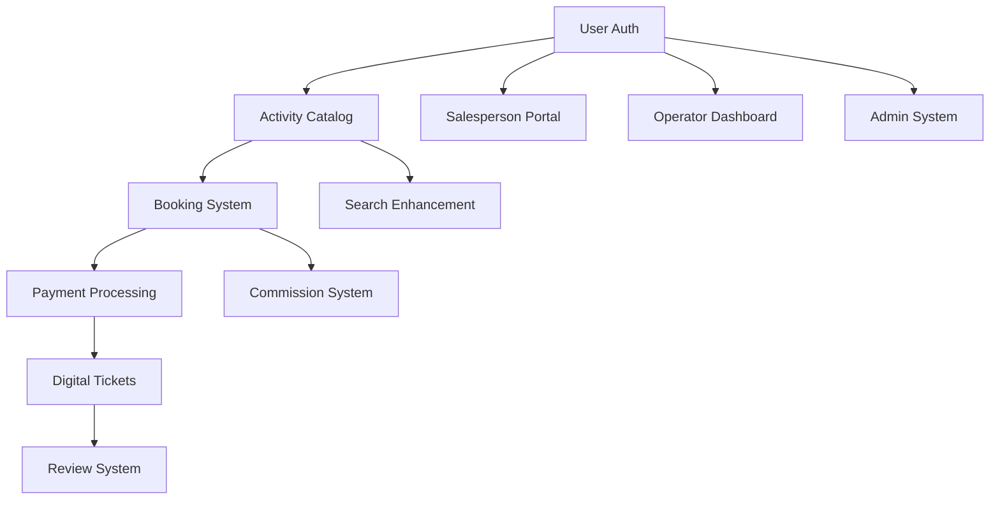

# 🗺️ Complete Feature Roadmap - Mallorca Activities Platform

**Purpose**: Comprehensive feature prioritization and implementation roadmap  
**Scope**: All platform features from MVP to advanced functionality  
**Framework**: Business impact vs development effort matrix

---

## 🎯 **Feature Priority Matrix**

### **🔥 Critical Path Features (MVP)**
*High Business Impact + Essential for Revenue*

#### **1. Activity Booking System** ⭐⭐⭐⭐⭐
- **Business Impact**: Direct revenue generation
- **Complexity**: High - Multi-step flow with payments
- **Timeline**: 2-3 weeks
- **Dependencies**: Activity catalog, User auth, Stripe
- **Revenue Impact**: €1M+ annual potential

**Key Components**:
- Multi-step booking flow (selection → details → payment)
- Real-time availability checking
- Stripe payment integration with deposit options
- Digital ticket generation with QR codes
- Booking confirmation and management

#### **2. Activity Detail Pages** ⭐⭐⭐⭐⭐
- **Business Impact**: Primary conversion driver
- **Complexity**: Medium-High - Rich media and integrations
- **Timeline**: 1-2 weeks  
- **Dependencies**: Database schema, Image optimization
- **Conversion Impact**: 60% of bookings start here

**Key Components**:
- Rich image/video galleries with lightbox
- Real-time pricing and availability display
- Reviews and rating system
- Interactive booking widget
- Similar activity recommendations

#### **3. User Authentication & Profiles** ⭐⭐⭐⭐⭐
- **Business Impact**: Customer retention and data
- **Complexity**: Medium - Clerk integration
- **Timeline**: 1 week
- **Dependencies**: Clerk setup, Database schema
- **Retention Impact**: 40% higher lifetime value

**Key Components**:
- Multi-role authentication (customers, operators, salespeople, admins)
- User profile management and preferences
- Booking history and digital ticket storage
- Wishlist and favorite activities
- Social login integration

---

### **💰 High-Value Features (Phase 2)**
*High Business Impact + Moderate Complexity*

#### **4. Salesperson Portal** ⭐⭐⭐⭐
- **Business Impact**: Unique distribution channel
- **Complexity**: Medium - Mobile-first interface
- **Timeline**: 2 weeks
- **Dependencies**: User auth, Commission system
- **Revenue Multiplier**: 2-3x through street sales

**Key Components**:
- Mobile-first sales dashboard with real-time inventory
- Commission tracking and performance analytics
- Quick booking interface for street sales
- Customer management and follow-up tools
- Digital brochures and presentation materials

#### **5. Operator Dashboard** ⭐⭐⭐⭐
- **Business Impact**: Platform growth and retention
- **Complexity**: Medium-High - Business management
- **Timeline**: 2-3 weeks
- **Dependencies**: User auth, Activity management
- **Growth Impact**: Operator retention and satisfaction

**Key Components**:
- Activity listing and inventory management
- Booking calendar and customer communication
- Performance analytics and revenue tracking
- Commission management and payouts
- Customer review response system

#### **6. Payment & Commission System** ⭐⭐⭐⭐
- **Business Impact**: Platform revenue optimization
- **Complexity**: High - Financial transactions
- **Timeline**: 2 weeks
- **Dependencies**: Stripe, Banking integration
- **Revenue Impact**: 15-20% platform commission

**Key Components**:
- Automated commission calculation and distribution
- Multi-currency support (EUR, USD, GBP)
- Deposit vs full payment options
- Refund and cancellation handling
- Financial reporting and tax compliance

---

### **🚀 Growth Features (Phase 3)**
*Medium-High Business Impact + Strategic Value*

#### **7. Advanced Search & Discovery** ⭐⭐⭐⭐
- **Business Impact**: Conversion optimization
- **Complexity**: Medium - AI/ML integration
- **Timeline**: 2 weeks
- **Dependencies**: Search infrastructure, Analytics
- **Conversion Boost**: 25%+ improvement

**Key Components**:
- Intelligent search with autocomplete and suggestions
- Advanced filtering (price, duration, difficulty, location)
- Personalized recommendations based on user behavior
- Visual search and map-based discovery
- Weather-based activity suggestions

#### **8. Review & Rating System** ⭐⭐⭐
- **Business Impact**: Trust building and SEO
- **Complexity**: Medium - Content moderation
- **Timeline**: 1-2 weeks
- **Dependencies**: Booking system, User auth
- **Trust Impact**: 40% improvement in conversion

**Key Components**:
- Verified review system (booking-based only)
- Photo and video review uploads
- Operator response system
- Review moderation and quality control
- Aggregate rating calculations and displays

#### **9. Multi-language Support** ⭐⭐⭐
- **Business Impact**: International market expansion
- **Complexity**: Medium - Content management
- **Timeline**: 2-3 weeks
- **Dependencies**: Translation service, CMS
- **Market Expansion**: German, English, Spanish markets

**Key Components**:
- Dynamic content translation system
- Localized pricing and currency display
- Cultural customization (date formats, preferences)
- Multi-language customer support
- SEO optimization for local markets

---

### **📊 Analytics & Optimization Features (Phase 4)**
*Strategic Long-term Value*

#### **10. Advanced Analytics Dashboard** ⭐⭐⭐
- **Business Impact**: Data-driven optimization
- **Complexity**: Medium-High - Data visualization
- **Timeline**: 2 weeks
- **Dependencies**: PostHog, Database analytics
- **Optimization Impact**: 20%+ revenue improvement

**Key Components**:
- Real-time booking and revenue analytics
- Customer behavior and conversion funnel analysis
- Operator performance tracking and insights
- Salesperson leaderboards and gamification
- Predictive analytics for demand forecasting

#### **11. Marketing & Promotion System** ⭐⭐⭐
- **Business Impact**: Customer acquisition and retention
- **Complexity**: Medium - Campaign management
- **Timeline**: 2 weeks
- **Dependencies**: Email service, Analytics
- **Growth Impact**: 30%+ customer acquisition

**Key Components**:
- Email marketing automation and newsletters
- Discount and promotional code system
- Loyalty program with points and rewards
- Referral program with incentives
- Social media integration and sharing

#### **12. Mobile App (PWA)** ⭐⭐⭐
- **Business Impact**: Mobile user experience
- **Complexity**: Medium - PWA development
- **Timeline**: 3 weeks
- **Dependencies**: Web platform completion
- **Mobile Market**: 70% of booking traffic

**Key Components**:
- Progressive Web App with offline capability
- Push notifications for booking updates
- Location-based activity discovery
- Mobile payment optimization
- App store optimization and deployment

---

### **🔧 Platform Enhancement Features (Phase 5)**
*Operational Efficiency & Scaling*

#### **13. Admin Management System** ⭐⭐⭐
- **Business Impact**: Platform operational efficiency
- **Complexity**: Medium-High - Comprehensive admin tools
- **Timeline**: 2-3 weeks
- **Dependencies**: User roles, Analytics
- **Operational Impact**: 50% reduction in manual work

**Key Components**:
- User management across all roles
- Activity approval and quality control
- Platform health monitoring and alerts
- Financial reconciliation and reporting
- Content management and moderation

#### **14. API & Integration Platform** ⭐⭐
- **Business Impact**: Partnership and scaling opportunities
- **Complexity**: High - API design and security
- **Timeline**: 3 weeks
- **Dependencies**: Core platform stability
- **Partnership Value**: Hotel and resort integrations

**Key Components**:
- RESTful API for third-party integrations
- Webhook system for real-time updates
- Partner dashboard for hotels and resorts
- White-label booking widget for websites
- API documentation and developer portal

#### **15. Advanced Notifications** ⭐⭐
- **Business Impact**: Customer communication optimization
- **Complexity**: Medium - Multi-channel integration
- **Timeline**: 1-2 weeks
- **Dependencies**: Communication services
- **Engagement Impact**: 25% improvement

**Key Components**:
- Multi-channel notifications (email, SMS, WhatsApp, Telegram)
- Automated booking reminder and follow-up sequences
- Weather-based activity alerts and rescheduling
- Personalized activity recommendations
- Emergency communication system

---

## 📅 **Implementation Timeline**

### **Phase 1: MVP Foundation (Weeks 1-6)**
*Critical Path - Revenue Generation*

**Week 1-2**: Core Infrastructure
- ✅ Landing page optimization (COMPLETED)
- User authentication and role system
- Basic activity catalog and detail pages

**Week 3-4**: Booking System
- Multi-step booking flow implementation
- Stripe payment integration
- Real-time availability system

**Week 5-6**: Essential Features
- Digital ticket system
- Basic user dashboard
- Operator activity management

**📊 Success Metrics**: 100+ monthly bookings, €15,000+ monthly revenue

---

### **Phase 2: Business Operations (Weeks 7-12)**
*Platform Growth & Revenue Optimization*

**Week 7-8**: Business Tools
- Salesperson portal development
- Commission calculation system
- Basic analytics implementation

**Week 9-10**: Operator Features
- Comprehensive operator dashboard
- Booking management system
- Performance analytics

**Week 11-12**: Platform Management
- Admin dashboard development
- Financial reporting system
- Quality control processes

**📊 Success Metrics**: 500+ monthly bookings, €75,000+ monthly revenue

---

### **Phase 3: Growth & Optimization (Weeks 13-20)**
*Market Expansion & Feature Enhancement*

**Week 13-15**: User Experience
- Advanced search and discovery
- Review and rating system
- Mobile optimization

**Week 16-18**: Market Expansion
- Multi-language support
- International payment options
- Local market customization

**Week 19-20**: Marketing Tools
- Promotional system
- Email marketing automation
- Loyalty program launch

**📊 Success Metrics**: 1,000+ monthly bookings, €150,000+ monthly revenue

---

### **Phase 4: Advanced Platform (Weeks 21-28)**
*Scaling & Innovation*

**Week 21-23**: Analytics & Insights
- Advanced analytics dashboard
- Predictive analytics implementation
- Performance optimization

**Week 24-26**: Mobile Experience
- Progressive Web App development
- Mobile payment optimization
- Push notification system

**Week 27-28**: Platform Integration
- API development
- Partner integration tools
- Third-party platform connections

**📊 Success Metrics**: 2,000+ monthly bookings, €300,000+ monthly revenue

---

## 🎯 **Feature Success Metrics**

### **Revenue Impact Features**
1. **Booking System**: €1M+ annual revenue potential
2. **Salesperson Portal**: 2-3x revenue multiplier
3. **Payment Optimization**: 15-20% commission capture
4. **Multi-language**: 40% market expansion

### **Conversion Impact Features**
1. **Activity Detail Pages**: 60% booking conversion source
2. **Search Enhancement**: 25% conversion improvement
3. **Review System**: 40% trust building
4. **Mobile Optimization**: 70% traffic capture

### **Operational Efficiency Features**
1. **Admin Dashboard**: 50% manual work reduction
2. **Analytics Platform**: 20% revenue optimization
3. **Automation Systems**: 30% efficiency improvement
4. **API Platform**: Partnership revenue streams

---

## 🔄 **Feature Dependencies & Integration**

### **Critical Path Dependencies**

### **Integration Complexity Matrix**
- **Low Complexity**: User profiles, Basic analytics, Email notifications
- **Medium Complexity**: Payment processing, Multi-language, Mobile PWA
- **High Complexity**: Real-time availability, Advanced analytics, API platform

---

## 🚨 **Risk Mitigation & Contingency**

### **Technical Risks**
1. **Payment Integration**: Stripe sandbox testing, fallback payment methods
2. **Real-time Systems**: WebSocket fallbacks, offline capability
3. **Performance**: CDN implementation, caching strategies
4. **Security**: Data encryption, PCI compliance, regular audits

### **Business Risks**
1. **Operator Adoption**: Incentive programs, onboarding support
2. **Customer Acquisition**: Marketing budget, SEO optimization
3. **Competition**: Feature differentiation, pricing strategy
4. **Seasonality**: Year-round activity portfolio, international markets

### **Contingency Plans**
- **Feature Simplification**: Reduce scope while maintaining core value
- **Third-party Alternatives**: Backup solutions for critical integrations
- **Phased Rollouts**: Gradual feature releases with user feedback
- **Performance Monitoring**: Real-time alerts and automatic scaling

---

**🗺️ FEATURE ROADMAP COMPLETE**: Comprehensive prioritization and implementation strategy for building a market-leading Mallorca Activities platform with clear business impact and technical feasibility assessment.