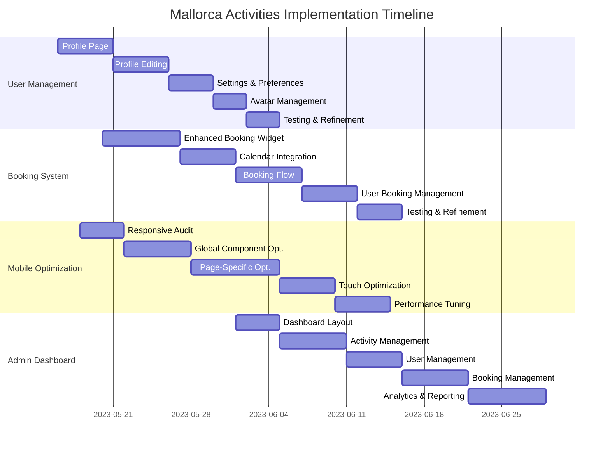
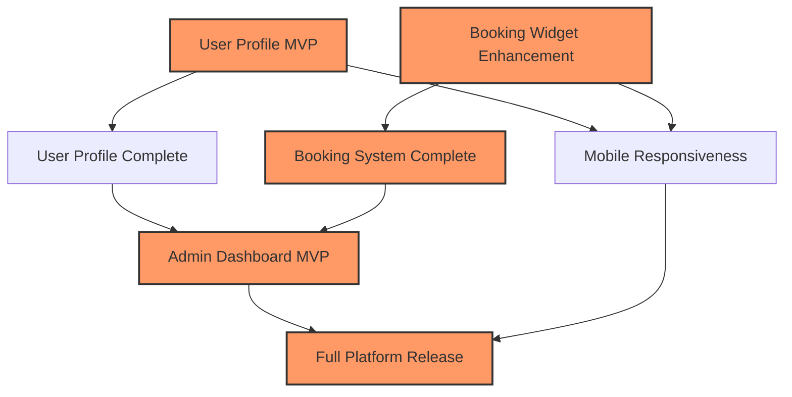

# 🗺️ Mallorca Activities Implementation Roadmap

This enhanced roadmap provides a comprehensive plan for implementing missing features in the Mallorca Activities platform.

## 📊 Visual Implementation Timeline

## 🏁 Key Milestones

| Milestone | Target Date | Description | Dependencies | Owner |
|-----------|-------------|-------------|--------------|-------|
| **M1: User Profile MVP** | 2023-05-25 | Basic profile page and editing | None | TBD |
| **M2: Booking Widget Enhancement** | 2023-06-01 | Improved booking experience | None | TBD |
| **M3: Mobile Responsiveness** | 2023-06-10 | Core pages fully responsive | M1, M2 | TBD |
| **M4: User Profile Complete** | 2023-06-15 | Full profile with settings & avatar | M1 | TBD |
| **M5: Booking System Complete** | 2023-06-25 | End-to-end booking experience | M2 | TBD |
| **M6: Admin Dashboard MVP** | 2023-07-10 | Basic admin functionality | M4, M5 | TBD |
| **M7: Full Platform Release** | 2023-07-31 | All features complete | All previous | TBD |

## 🔄 Agile Sprint Planning

### Sprint 1 (May 16-29): User Management Foundation
- **Goals:**
  - Implement basic profile page
  - Create profile editing functionality
  - Begin mobile responsiveness audit
- **User Stories:**
  - As a user, I can view my profile information
  - As a user, I can edit my personal details
  - As a user, I can navigate the site on mobile

### Sprint 2 (May 30-Jun 12): Booking Experience
- **Goals:**
  - Enhance booking widget
  - Implement calendar integration
  - Continue mobile optimization
- **User Stories:**
  - As a user, I can select booking dates easily
  - As a user, I can see real-time availability
  - As a user, I can complete booking on mobile

### Sprint 3 (Jun 13-26): User Experience Completion
- **Goals:**
  - Complete user profile features
  - Finish booking flow
  - Implement profile settings
- **User Stories:**
  - As a user, I can manage my notification preferences
  - As a user, I can upload a profile picture
  - As a user, I can view my booking history

### Sprint 4 (Jun 27-Jul 10): Admin Foundations
- **Goals:**
  - Create admin dashboard layout
  - Implement activity management
  - Begin user management in admin
- **User Stories:**
  - As an admin, I can view key performance metrics
  - As an admin, I can manage activities
  - As an admin, I can search and filter users

### Sprint 5 (Jul 11-24): Admin Completion
- **Goals:**
  - Complete booking management
  - Implement analytics
  - Finalize admin features
- **User Stories:**
  - As an admin, I can manage bookings
  - As an admin, I can view reports and analytics
  - As an admin, I can export data

### Sprint 6 (Jul 25-Aug 7): Refinement & Launch
- **Goals:**
  - Final testing and bug fixes
  - Performance optimization
  - Documentation completion
- **User Stories:**
  - As a user, I experience a fast, error-free platform
  - As an admin, I have comprehensive documentation
  - As a stakeholder, I can view platform analytics

## 🔍 Feature Prioritization Matrix

| Feature | Impact (1-10) | Effort (1-10) | Priority Score | Implementation Order |
|---------|---------------|---------------|----------------|----------------------|
| User Profile Page | 8 | 4 | 2.0 | 1 |
| Booking Widget Enhancement | 9 | 6 | 1.5 | 2 |
| Mobile Responsiveness | 8 | 7 | 1.1 | 3 |
| User Settings | 6 | 5 | 1.2 | 5 |
| Booking Flow Completion | 9 | 8 | 1.1 | 4 |
| Avatar Management | 5 | 3 | 1.7 | 6 |
| Admin Dashboard | 7 | 7 | 1.0 | 7 |
| Admin Activity Management | 8 | 6 | 1.3 | 8 |
| Admin User Management | 7 | 6 | 1.2 | 9 |
| Admin Booking Management | 8 | 7 | 1.1 | 10 |
| Analytics & Reporting | 7 | 8 | 0.9 | 11 |

*Priority Score = Impact/Effort, higher is better*

## 🔄 Dependencies & Critical Path

## ⚠️ Risk Assessment & Mitigation

| Risk | Impact | Probability | Severity | Mitigation Strategy |
|------|--------|-------------|----------|---------------------|
| Auth integration issues | High | Medium | High | Early testing with Clerk, have fallback auth plan |
| Calendar functionality complexity | Medium | High | High | Start early, use established libraries, consider simplifying MVP |
| Mobile responsiveness challenges | Medium | Medium | Medium | Mobile-first approach, regular testing on multiple devices |
| Performance issues with booking system | High | Medium | High | Load testing early, optimize database queries |
| API rate limits with external services | Medium | Low | Medium | Implement proper caching, have fallback functionality |
| Team resource constraints | High | Medium | High | Prioritize features, consider phased approach |

## 📊 Success Metrics

| Feature | Key Performance Indicator | Target | Measurement Method |
|---------|---------------------------|--------|-------------------|
| User Management | Profile completion rate | >80% | Database analysis |
| User Management | Settings engagement | >50% | Event tracking |
| Booking System | Booking conversion rate | >10% | Funnel analysis |
| Booking System | Calendar usage | >70% | Event tracking |
| Booking System | Abandoned bookings | <30% | Funnel analysis |
| Mobile Optimization | Mobile conversion rate | >5% | Analytics by device |
| Mobile Optimization | Mobile bounce rate | <40% | Analytics by device |
| Admin Dashboard | Admin task completion time | <5 min | Time tracking |
| Admin Dashboard | Data export usage | >10/week | Event tracking |

## 🔄 Implementation Approach

### Development Methodology
- **Agile Scrum** with 2-week sprints
- Daily standups to track progress
- Sprint planning and retrospectives
- Continuous integration and deployment

### Testing Strategy
- Unit testing for all server actions
- Integration testing for user flows
- Mobile-specific testing suite
- Performance testing for critical paths
- User acceptance testing before release

### Deployment Strategy
- Feature flagging for gradual rollout
- Staged deployments (dev → staging → prod)
- Rollback capability for all features
- A/B testing for critical user interfaces

## 🛠️ Technical Architecture Considerations

### Performance Optimization
- Implement server-side caching for activity data
- Use React.lazy and Suspense for code splitting
- Optimize image loading with proper sizing and formats
- Implement database query optimization

### Scalability Planning
- Design booking system to handle peak seasonal loads
- Structure database for efficient querying
- Use pagination for all list endpoints
- Consider serverless functions for background processing

### Security Measures
- Implement proper authentication guards on all routes
- Validate all inputs server-side
- Use parameterized queries to prevent SQL injection
- Implement rate limiting for sensitive endpoints

## 📱 Mobile-First Implementation Details

### Responsive Framework Usage
- Consistent use of Tailwind breakpoints
- Component-specific mobile adaptations
- Viewport-aware rendering optimizations
- Touch target sizing standards (minimum 44×44px)

### Performance Targets
- First Contentful Paint < 1.5s on 3G
- Time to Interactive < 3.5s on 3G
- Lighthouse Performance Score > 80
- Total bundle size < 300KB (initial load)

## 📝 Documentation Plan

### Developer Documentation
- API documentation with examples
- Component usage guidelines
- State management patterns
- Testing guidelines

### User Documentation
- Admin user manual
- Help center articles
- Video tutorials for complex workflows
- Contextual help within the application

## 👥 Stakeholder Communication Plan

| Stakeholder Group | Communication Method | Frequency | Key Information |
|-------------------|----------------------|-----------|-----------------|
| Project Sponsors | Status Report | Bi-weekly | Milestone progress, risks, resource needs |
| Development Team | Stand-up | Daily | Tasks, blockers, progress |
| End Users | Release Notes | Per Release | New features, improvements, bug fixes |
| Testers | Test Plans | Per Sprint | Test coverage, focus areas |
| Marketing | Feature Briefs | Per Major Feature | Value proposition, screenshots, launch timing |

## 🔍 Post-Implementation Evaluation

### Review Criteria
- Feature completeness against requirements
- Performance against established metrics
- User feedback and satisfaction
- Technical debt assessment
- Lessons learned documentation

### Maintenance Plan
- Bug fix prioritization framework
- Regular performance monitoring
- User feedback collection mechanism
- Quarterly feature enhancement planning

---

## Detailed Feature Implementation References

- [User Management Plan](./research-logs/user-management-plan.md)
- [Booking System Plan](./research-logs/booking-system-plan.md)
- [Admin Dashboard Plan](./research-logs/admin-dashboard-plan.md)
- [Mobile Optimization Plan](./research-logs/mobile-optimization-plan.md)

---

Last Updated: 2023-05-15 